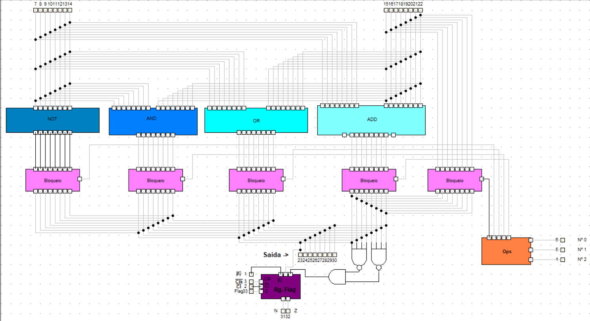

# NEANDER

>Colaboradores: Heloisa Alves ([Github Profile](https://github.com/Helogizzy)), Ellen Bonafin ([GitHub Profile](https://github.com/EllenBonafin)) e Gabriel Mazzuco ([Github Profile](https://github.com/gabrielmazz))

## Descrição
O Neander é um computador super simples utilizado para fins didáticos. Ele possui apenas um modo de endereçamento: o modo direto. Nesse modo de endereçamento a palavra que segue o código da instrução contém nas instruções de manipulação de dados o endereço de memória do operando. Nas instruções de desvio, esse endereço corresponde à posição de memória onde está a próxima instrução a ser executada.

## Características
- Largura de dados e de endereços de 8 bits.
- Dados representados em complemento de 2.
- Modo de endereçamento de 8 bits.
- Um registrador acumulador de 8 bits.
- Um apontador de instruções de 8 bits.
- Um registrador de estado com 2 códigos de condição: negativo e zero.
- Conjunto de instruções.

## Sistema Geral
O registrador síncrono do Program Counter (PC) foi reaproveitado para as unidades: AC, RDM e RI.

## Módulo Memória
Composto por:
- Registrador RDM.
- Registrador REM.
- Multiplexador 2x8.
- Memória 256x8.
- Dois bloqueios.

## Módulo ULA
Composto por:
- Registrador Acumulador (AC).
- Registrador de Flas (encontra-se dentro da ULA).
- Bloqueio.
- Unidade Lógica Aritmética (ULA).

### Parte interna da ULA
Composto por:
- Registrador de Flags.
- Componente OPS que determina qual operação será apresentada.
- Multiplexador 5x8 (foi substituído por 5 bloqueios).
- Operações: NOT, AND, OR e ADD.

## Módulo UC
Composto por:
- Program Counter (PC).
- Registrador de Instruções (RI).
- Decodificador.
- Unidade de Controle.

### Parte interna da UC
- O presset e clear do contador estava invertido, foi feita uma ligação cruzada para corrigir o erro.
- Todos os 11 módulos foram criados (LDA, NOT, OR, ADD, JUMP, JN, JZ, HLT, STA, e NOP).

